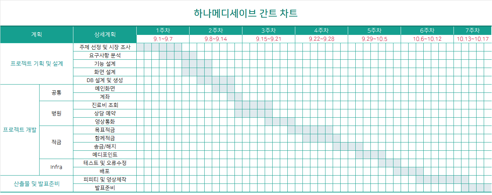
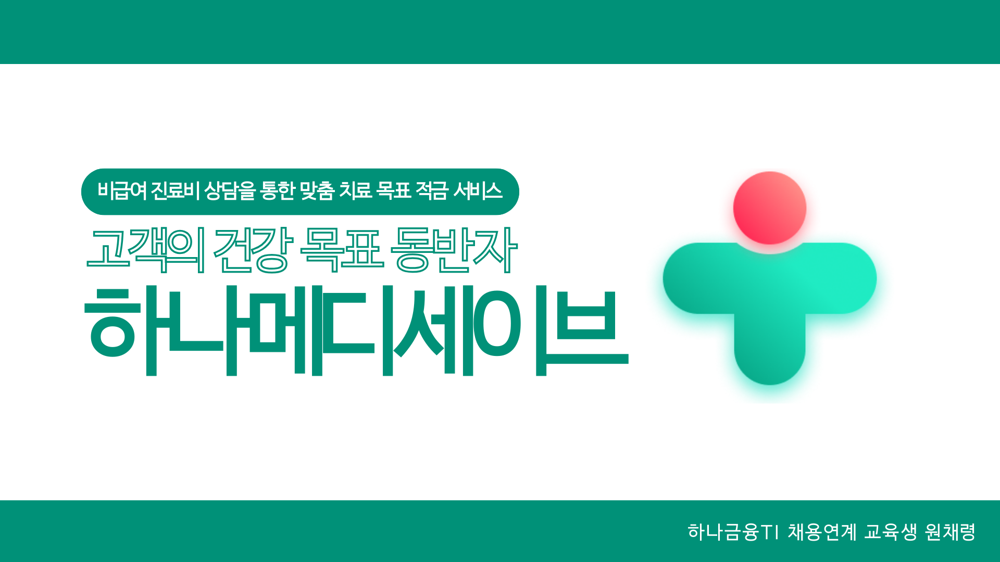
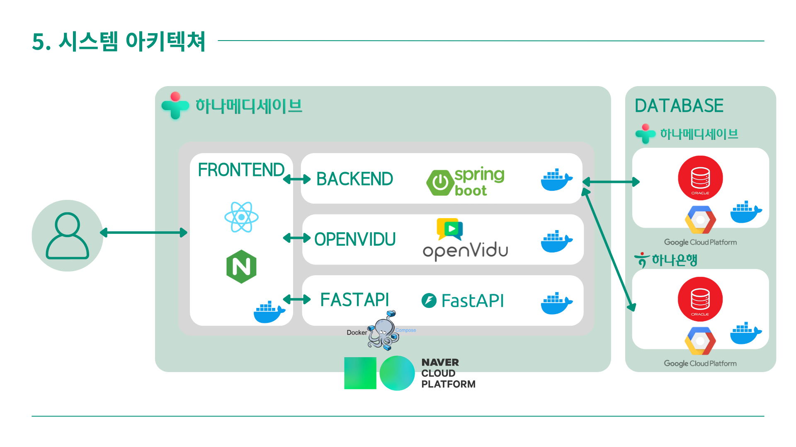
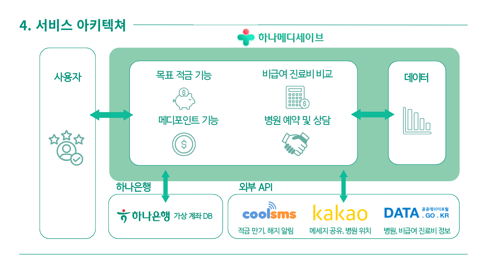

# 비급여 진료비 상담을 통한 목표 적금 서비스 - 하나메디세이브(HANA MEDISAVE)

## 1. 프로젝트 소개

### 1-1. 프로젝트 기획 배경
- 건강보험 적용이 불가한 고액 비급여 진료비 부담이 증가하고 있음. 실손보험의 지급 거절 사례도 늘어나는 추세.
- 병원마다 비급여 진료비가 천차만별로 다르며, 이를 비교하고 예산을 설정하는 것이 어려운 상황.
- 비급여 진료비에 대비해 금융자산을 준비할 수 있는 적금 서비스의 필요성이 대두됨.

### 1-2. 개인적인 경험
- 아버지께서 백내장 수술을 받았는데 비급여 치료이므로 건강보험을 적용받지 못했고, 실손 보험금 지급도 거절당한 적이 있었음.
- 

### 1-3. 개발환경
- OS: Windows 10
- Framework: Spring Boot(Backend), React js(Frontend)
- Tool: IntelliJ, VS Code, SQL Developer, Github
- DBMS: Oracle DBMS

### 1-4. 수행기간
- 개발기간: 2024.09.01 - 2024.10.28

---

## 2. 프로젝트 제안서

### 2-1. 프로젝트 개요
- 비급여 진료비 비교와 병원 상담을 통해 합리적인 목표 예산 설정이 가능한 플랫폼
- 사용자들이 목표 치료비와 기간을 설정하면 자동으로 적금 납부를 계산하여 관리할 수 있는 서비스 제공
- 목표 적금: 목표 치료비에 맞춰 적금을 설정하고 납부 가능
- 함께 적금: 서로의 건강 파트너로 초대하여 적금 참여를 독려하는 기능
- 메디포인트: 치료 후 서류 증빙 시 적금 납입에 사용할 수 있는 포인트 지급
- 병원 비교 및 상담: 병원별 비급여 진료비를 비교하고 상담을 통해 합리적인 목표 설정을 돕는 서비스

### 2-2. 타사 기능 비교
- 대부분의 타사 적금 상품은 단순한 목표금액 설정과 만기 시 해지만 지원하며, 추가 혜택이나 의료 관련 정보 제공이 부족함.
- 경남은행의 버킷리스트 적금은 목표금액 설정과 자동 해지 기능을 제공하지만, 병원 정보 제공이나 추가 혜택은 없음.
- 하나은행 모임통장은 입금 현황 공유가 가능하지만 해지 후 추가 혜택이나 병원 정보 제공 기능은 부족함.
- 하나메디세이브는 목표금액 설정, 입금 현황 공유, 만기 해지 알림, 해지 후 추가 혜택, 병원 정보 제공까지 모두 지원하는 종합적인 서비스로, 비급여 진료에 대비한 최적의 금융 솔루션을 제공함.

### 2-3. 시스템 아키텍처

### 2-4. 적용기술
- SPRING 기반으로 적금 서비스 및 병원 정보 제공 웹 애플리케이션 제작
- SCHEDULER를 이용한 자동 적금 이체 기능 구현
 COOL SMS를 통해 만기 전 문자 알림 서비스 제공
- Google Vision API를 사용한 진료비 영수증 OCR 처리
- FastAPI 기반의 Python 서버로 이미지 처리 수행
- Redux를 사용한 사용자 상태 관리
- Web Socket을 활용해 적금 참여자들에게 실시간 알림 및 병원 예약 알림 전송
- OpenVidu를 통해 비급여 진료에 대한 비대면 실시간 화상 상담 서비스 구현

---

## 3. 프로젝트 결과

### 3-1. 서비스 아키텍처

### 3-2. ERD

---

## 4. 본인 소개

| 구분            | 내용                                      | 비고                                           |
|-----------------|-------------------------------------------|------------------------------------------------|
| 이름            | 원채령                                    |                                              |
| 연락처          | kimchae1205@gmail.com                      |                                                |
| Frontend skill  | HTML, CSS, Javascript, React, Vue, Flutter |                                                |
| Backend skill   | Java, Spring, Oracle                      |                                                |
| 자격증          |                                           |                                                |
| OPIC(IH)       | 2022.12.17                                |                                                |
| SQL개발자 (SQLD)| 2022.12.02                                |                                                |
| 수상내역        | 프로젝트 우수상                            | 삼성전자주식회사         (2023.05.26)           |
|                 | 프로젝트 우수상                           | 삼성전자주식회사         (2023.05.26)             |
| 교육활동        | 삼성 청년 SW 아카데미(8기)                 | 2022.07.06 - 2023.06.30 (1600시간)               |
|                 | 하나금융TI 채용전환형 교육                | 2024.03.04 ~ 2024.10.20 (1200시간 )               |
